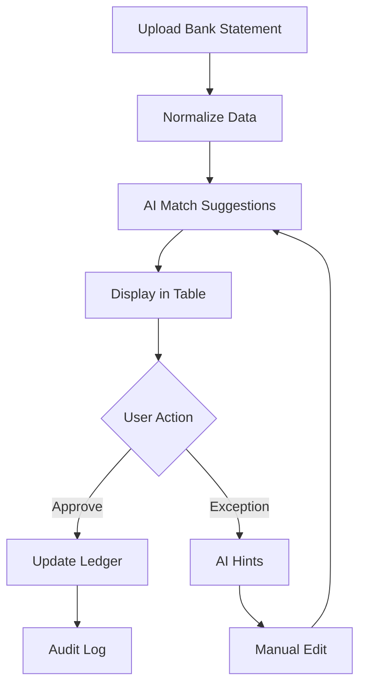
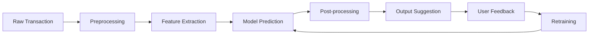

# Sifr: AI-Native Accounting Platform PRD

## Screenshot Summaries
Detailed summaries of Xero screenshots are available in the docs/ folder:
- [10-home.md](docs/10-home.md): Home dashboard overview.
- [20-sales-menu.md](docs/20-sales-menu.md): Sales and invoicing management.
- [30-purchases-menu.md](docs/30-purchases-menu.md): Purchases and expense tracking.
- [40-reporting-menu.md](docs/40-reporting-menu.md): Financial reporting tools.
- [50-accounting-menu.md](docs/50-accounting-menu.md): Core accounting and reconciliation.
- [60-tax-menu.md](docs/60-tax-menu.md): Tax compliance and calculations.
- [70-tax-menu.md](docs/70-tax-menu.md): Advanced tax features.

These summaries inform the feature set, ensuring workflow mimicry without copying assets.

## 1. Product Overview

### Mission and Vision
**Mission:** To democratize accounting by providing an AI-powered, legally reimplemented clone of Xero workflows, enabling small-to-medium businesses (SMBs) to manage finances efficiently with minimal manual effort, while ensuring compliance and scalability.

**Vision:** Become the leading AI-native accounting platform that combines human expertise with machine learning to automate reconciliation, categorization, and reporting, supporting both cloud and local deployments for global SMBs.

### User Personas
- **SMB Owners:** Non-accountants who need intuitive dashboards for financial health monitoring, quick invoice creation, and basic reporting.
- **Bookkeepers:** Professionals handling daily transactions, reconciliation, and compliance; value efficiency tools like AI matching and batch approvals.
- **Accountants:** Experts requiring advanced reporting, audit trails, tax compliance, and multi-currency support; seek AI explanations for exceptions.

### Core Value Propositions vs Xero
- **AI-Assisted Automation:** AI-driven reconciliation and categorization reduce manual work by 70%, with learning from corrections for continuous improvement.
- **User-Driven Ingestion:** Manual CSV/PDF/email import for privacy-focused users, with optional Open Banking adapters.
- **Multicurrency Abstractions:** Native support for global operations without complexity.
- **Extensibility:** Designed for desktop local deployment with cloud syncing, third-party integrations, and future AI enhancements.
- **Legal Reimplementation:** Workflow mimicry without copying UI assets or code, focusing on functional equivalence.

### Differentiation via AI and Automation
- **AI Match Engine:** Suggests ledger account matches for transactions, learning from user corrections.
- **Audit Explanations:** Provides natural language explanations for transactions and exceptions.
- **Batch Operations:** AI-prioritized exception handling for high-volume reconciliation.
- **Continuous Learning:** Rule engine adapts to user patterns, reducing exceptions over time.

## 2. Functional Requirements

### Home Dashboard
- **Real-Time Financial Overview:** Bank balances, P&L summaries, outstanding invoices, recent transactions, cash flow charts.
- **Quick Actions:** Create invoices, record expenses, access reconciliation.
- **Notifications:** Alerts for overdue items, low balances.

### Sales Management
- **Invoice Lifecycle:** Creation, sending, tracking payments, reminders.
- **CRM Integration:** Customer database with history and terms.
- **Bulk Operations:** Multi-select for send, print, email.
- **Multi-Currency Support:** Invoices in various currencies.

### Purchases and Expenses
- **Bill Management:** Creation, approval workflows, payment scheduling.
- **Supplier Database:** Contact info, terms, history.
- **Purchase Orders:** Tracking and inventory linkage.
- **Expense Categorization:** Manual/auto assignment.

### Reporting
- **Standard Reports:** P&L, balance sheet, cash flow, aged receivables.
- **Customization:** Filters, date ranges, exports.
- **Drill-Down:** Interactive charts to transaction details.
- **Scheduled Delivery:** Automated email reports.

### Core Accounting
- **Chart of Accounts:** Hierarchical structure with classifications.
- **Bank Reconciliation:** Transaction matching interface.
- **Manual Journals:** Adjusting entries with validation.
- **Audit Trails:** Immutable logs for changes.

### Tax Compliance
- **Tax Codes/Rates:** Configurable per jurisdiction.
- **BAS/GST Filing:** Auto-calculations and forms.
- **Reminders:** Deadline alerts.
- **Historical Returns:** Archive and amendments.

### Ledger Engine
- **Chart of Accounts:** Hierarchical structure with standard categories (assets, liabilities, equity, income, expenses); customizable for industries.
- **Double-Entry Bookkeeping:** Enforced for all transactions; supports splits, refunds, and partial payments.
- **Tax Codes:** Configurable tax rates and codes per jurisdiction; automated application to transactions.
- **Period Locking:** Lock historical periods for audit compliance; configurable by user role.

### Invoicing, Billing, Payments
- **Invoice Creation:** Template-based with customer selection, line items, taxes, and due dates; multi-currency support.
- **Billing Workflows:** Send, track, and remind for overdue invoices; integrate with payment gateways.
- **Payments:** Record manual payments; link to bank transactions for reconciliation.

### Bank Statement Ingestion
- **User-Driven Methods:** CSV upload with mapping wizard; PDF parsing for statements; email forwarding with extraction.
- **Normalization Layer:** Standardize inputs to transaction schema; handle edge cases like multi-page PDFs or email attachments.
- **Optional Adapters:** Future Open Banking/API connectors for automated feeds.

### Reconciliation
- **AI-Driven Match Suggestions:** Score-based matching (amount, date, merchant) with confidence levels.
- **Rule Engine:** User-defined rules plus AI-learned patterns; batch processing for efficiency.
- **Batch Approvals:** Review and approve matches in bulk; handle partial payments and exceptions.
- **Exceptions:** Flag unmatched transactions with AI recommendations; manual override with audit logging.

### Reporting
- **Standard Reports:** P&L, balance sheet, cash flow; tax-ready formats (BAS/GST).
- **Custom Reports:** User-configurable filters, date ranges, and exports (PDF, CSV, Excel).
- **Real-Time Dashboards:** Visual metrics with drill-down to transactions.

### Audit & Compliance
- **Change Logs:** Immutable audit trails for all transactions and changes.
- **Transaction Explanations:** AI-generated summaries for audit purposes.
- **Exception Tracking:** Logs for reconciliation discrepancies and resolutions.

## 3. UX & Workflow Design

### Home Dashboard UI
- Top navigation with quick-access icons and search.
- Collapsible sidebar for module navigation.
- Widgets: Bank balances, P&L, invoices, transactions, cash flow chart.
- Prominent action buttons for common tasks.

### Sales Menu UI
- Tabular invoice list with filters and bulk actions.
- Invoice creation form with customer selection and line items.
- Status indicators and CRM integration.

### Purchases Menu UI
- Bills list with supplier details.
- Approval workflow status.
- Purchase order tracking.

### Reporting Menu UI
- Report library grid with customization panels.
- Interactive charts with drill-down.
- Export options.

### Accounting Menu UI
- Hierarchical chart of accounts.
- Reconciliation matching interface.
- Journal entry forms.

### Tax Menu UI
- Tax codes configuration.
- Filing forms with auto-calculations.
- Historical archive.

### User Stories Table

| As a | I want to | So that | Acceptance Criteria |
|------|-----------|---------|---------------------|
| Bookkeeper | Upload CSV bank statement | Import transactions manually | File parsed, transactions listed with mapping wizard |
| Accountant | View AI match suggestions | Reconcile faster | Suggestions shown with confidence scores, approve/reject |
| SMB Owner | Create invoice quickly | Bill customers | Template pre-fills, multi-currency support |
| Auditor | See transaction explanations | Verify compliance | AI-generated summaries for each entry |
| Developer | Integrate Open Banking | Automate ingestion | API endpoints for third-party feeds |

### Bank Reconciliation Table
- **Layout:** Table with columns: Date, Description, Amount, Suggested Match, Confidence, Actions (Approve/Reject/Exception).
- **Match Workflow:** Select transaction → View AI suggestions → Approve or edit → Batch submit.
- **Exception Handling:** Flag exceptions → AI hints (e.g., "Possible split payment") → Manual resolution.

### Invoice and Bill Creation/Edit Workflow
- **Steps:** Select customer/supplier → Add line items → Apply taxes → Preview → Send/Approve.
- **Batch Operations:** Bulk send, print, or export invoices.

### Batch Operations, Exception Review
- **Interface:** Paginated lists with filters; bulk actions (approve all, flag exceptions).
- **AI Hints:** Inline tooltips with explanations (e.g., "This matches 95% based on merchant history").

### Example User Flows
- **Reconciliation Flow:** User uploads CSV → Normalize → AI matches → Review table → Approve batch → Log audit.
- **Exception Edge Case:** Unmatched transaction → AI suggests split → User edits → Re-match → Approve.

#### Reconciliation Workflow Diagram (Mermaid)


### Keyboard Shortcuts, Efficiency Patterns
- **Shortcuts:** Ctrl+S (save), Tab navigation, Enter to approve.
- **Patterns:** Auto-save drafts, predictive search for accounts/customers.

### AI Hints, Inline Explanations
- **Hints:** Hover tooltips for match suggestions; expandable explanations for exceptions.
- **Alerts:** Notifications for high-confidence matches or overdue reconciliations.

## 4. Technical Architecture

### Backend
- **Services:** WebAPI (ASP.NET Core) for sync and AI offloading; Local Desktop App (Blazor Hybrid/MAUI).
- **Database:** SQLite (Local-First) with Sync to SQL Server/PostgreSQL (Cloud Backend).
- **Sync Engine:** Dotmim.Sync for bidirectional data synchronization.
- **Normalization Layer:** ETL pipeline for CSV/PDF/email inputs.
- **Ledger:** In-memory or cached double-entry engine.
- **AI Integration:** REST API to AI modules for predictions.

#### Backend Service Diagram (Mermaid)
```mermaid
graph TD
    A[Blazor WASM Frontend] --> B[WebAPI Gateway]
    B --> C[Ledger Service]
    B --> D[Reconciliation Service]
    B --> E[Reporting Service]
    D --> F[AI Service]
    C --> G[SQLite Local DB]
    D --> G
    E --> G
    G <--> I[Dotmim.Sync]
    I <--> J[Cloud DB (PostgreSQL/SQL Server)]
    F --> H[ML Models]
```

### Frontend
- **Framework:** Blazor WASM for responsive web app; PWA for offline capabilities.
- **Browser Extension:** For user-driven extraction (CSV/PDF from bank sites).

### AI Modules
- **Reconciliation Engine:** ML model (e.g., BERT for text matching) trained on transaction data.
- **Categorization:** Rule-based + ML for merchant inference.
- **Audit Explanations:** NLP model for generating summaries.

### Security & Compliance
- **Encryption:** AES-256 for data at rest/transit; OAuth for auth.
- **Privacy:** AU/GDPR/CCPA compliant; user consent for data processing.
- **Access Control:** Role-based (owner, accountant, bookkeeper).

### Extensibility
- **Plugins:** Modular design for Open Banking, third-party apps.
- **Sync:** Local-First architecture using Dotmim.Sync to synchronize SQLite (Client) with Cloud DB. Handles conflict resolution and offline capabilities.

### API Contract Schemas
- **Reconciliation Match API:** POST /api/reconcile/match { transactionId: UUID, suggestions: [] } → { matched: bool, accountId: UUID }
- **AI Explanation API:** GET /api/ai/explain/{transactionId} → { explanation: string }

## 5. AI Module Specifications

### AI Modules Table

| Module | Input | Output | Model/Logic | Training Data |
|--------|-------|--------|-------------|---------------|
| Auto-Match Engine | Transaction (date, amount, description) | Suggested account + confidence score | Supervised ML (e.g., Random Forest) | Historical matches |
| Merchant & Category Inference | Description, amount | Merchant name, category | Regex + ML (BERT) | Vendor databases, user history |
| Tax Code Prediction | Transaction details, jurisdiction | Tax code | Rule-based + ML | Tax regulations, past applications |
| Audit Explanations | Transaction + context | Natural language summary | NLP (GPT-based) | Labeled transaction data |
| Exception Recommendations | Unmatched transaction | Suggested actions | Rule engine + ML | Exception logs |

#### AI Pipeline Breakdown (Mermaid)


### Auto-Match Engine
- **Input:** Transaction (date, amount, description).
- **Output:** Suggested account + confidence score.
- **Model:** Supervised learning on historical matches.

### Merchant & Category Inference
- **Logic:** Regex + ML for merchant names; map to categories.
- **Learning:** Update from user corrections.

### Tax Code Prediction
- **Rules:** Jurisdiction-based defaults + AI overrides.

### Audit Explanations & Exception Recommendations
- **NLP:** Generate explanations like "This expense matches office supplies based on vendor history."

### Learning from Corrections
- **Feedback Loop:** Retrain models on approved/rejected matches.

## 6. Data Model & Normalization

### Transaction Schema Table

| Field | Type | Constraints | Description |
|-------|------|-------------|-------------|
| ID | UUID | Primary Key, Not Null | Unique transaction identifier |
| Date | DateTime | Not Null | Transaction date |
| Amount | Decimal | Not Null, Precision 18,2 | Transaction amount |
| Currency | String | Not Null, FK to Currencies | Currency code (e.g., USD) |
| Description | String | Not Null | Transaction description |
| AccountID | UUID | FK to Accounts, Nullable | Matched ledger account |
| Status | Enum | Not Null (Pending/Matched/Exception) | Reconciliation status |
| Source | String | Not Null | Ingestion source (CSV/PDF/Email) |
| CreatedAt | DateTime | Not Null | Timestamp of creation |
| UpdatedAt | DateTime | Not Null | Timestamp of last update |

### Normalization
- **CSV:** Map columns to schema; handle delimiters.
- **PDF:** OCR + parsing for tables.
- **Email:** Extract attachments; parse text.

### Mapping to Ledger
- **Splits:** Support multiple account allocations.
- **Refunds/Partials:** Negative amounts with links.

## 7. KPIs & Success Metrics
- **AI Match Accuracy:** >90% for trained users.
- **Time Saved:** 50% reduction in reconciliation time.
- **Exceptions:** <5% manual interventions.
- **Adoption:** 80% user retention at 6 months.

## 8. Roadmap & Phases

### Phase 1: MVP – Core Workflows
- Home dashboard with basic metrics.
- Sales: Invoice creation and tracking.
- Purchases: Bill management.
- Accounting: Chart of accounts and basic reconciliation.
- CSV/PDF ingestion with AI matching.
- Basic reporting (P&L, balance sheet).

### Phase 2: Enhancements
- Full reconciliation with AI explanations.
- Advanced reporting with drill-down.
- Tax compliance basics.
- Batch approvals and exception handling.
- Multi-currency support.

### Phase 3: Scale and Advanced Features
- Open Banking integration.
- Multi-company support.
- Payroll and inventory modules.
- Desktop local deployment with cloud sync.
- Advanced AI: Predictive analytics, anomaly detection.

## 9. Risk Assessment
- **Legal/IP:** Workflow reimplementation only.
- **Technical:** PDF parsing edge cases.
- **UX:** AI trust-building.

## 10. Competitive Analysis
- Vs Xero: AI differentiation.
- Opportunities: Workflow disruption.

### Actionable Engineering Tasks
Each task is broken down into granular subtasks (tickets) that can be assigned to developers. Each ticket includes description, acceptance criteria, and dependencies.

1. **Project Setup**
   - **Ticket 1.1: Initialize Blazor WASM Solution**
     - Description: Create a new Blazor WebAssembly project with ASP.NET Core WebAPI backend using .NET 8. Configure project structure with separate folders for Client, Server, Shared.
     - Acceptance Criteria: Solution builds successfully; basic "Hello World" page renders in browser.
     - Dependencies: None.
   - **Ticket 1.2: Configure Authentication**
     - Description: Implement OAuth authentication with role-based access (Owner, Accountant, Bookkeeper). Use ASP.NET Identity or external provider.
     - Acceptance Criteria: Login/logout works; roles assigned correctly.
     - Dependencies: Ticket 1.1.
    - **Ticket 1.3: Set Up Database (SQLite)**
      - Description: Install `Microsoft.EntityFrameworkCore.Sqlite`. Configure `ApplicationDbContext` to use SQLite.
      - Acceptance Criteria: Application creates `sifr.db` locally; migrations apply successfully.
      - Dependencies: Ticket 1.1.
   - **Ticket 1.4: CI/CD Pipeline**
     - Description: Set up GitHub Actions or Azure DevOps for build, test, deploy.
     - Acceptance Criteria: Pipeline runs on push; deploys to staging.
     - Dependencies: Ticket 1.1.

2. **Database Design**
   - **Ticket 2.1: Define Core Entities**
     - Description: Create EF models for User, Company, Account, Transaction, Invoice, Bill, TaxCode.
     - Acceptance Criteria: Models compile; relationships defined.
     - Dependencies: Ticket 1.3.
   - **Ticket 2.2: Implement Multi-Tenancy**
     - Description: Add TenantId to entities; configure query filters.
     - Acceptance Criteria: Data isolated per tenant.
     - Dependencies: Ticket 2.1.
   - **Ticket 2.3: Migrations and Seeding**
     - Description: Create initial migrations; seed chart of accounts, tax codes.
     - Acceptance Criteria: DB schema created; sample data inserted.
     - Dependencies: Ticket 2.2.

3. **Home Dashboard**
   - **Ticket 3.1: Dashboard Layout**
     - Description: Build responsive layout with sidebar navigation and main content area.
     - Acceptance Criteria: Layout renders on desktop/mobile.
     - Dependencies: Ticket 1.1.
   - **Ticket 3.2: Bank Balance Widget**
     - Description: Create component to display aggregated bank balances from API.
     - Acceptance Criteria: Balances update in real-time.
     - Dependencies: Ticket 3.1, API endpoints.
   - **Ticket 3.3: P&L Summary Widget**
     - Description: Implement P&L calculation and display with charts.
     - Acceptance Criteria: Accurate calculations; interactive chart.
     - Dependencies: Ticket 3.1, Reporting API.
   - **Ticket 3.4: Outstanding Invoices Widget**
     - Description: List overdue invoices with links to details.
     - Acceptance Criteria: Filters work; drill-down enabled.
     - Dependencies: Ticket 3.1, Sales API.

4. **Sales Module**
   - **Ticket 4.1: Invoice CRUD API**
     - Description: Build WebAPI endpoints for create, read, update, delete invoices.
     - Acceptance Criteria: CRUD operations work via Postman.
     - Dependencies: Ticket 2.3.
   - **Ticket 4.2: Customer Management**
     - Description: Implement customer database with search and CRUD.
     - Acceptance Criteria: Customers added/edited; linked to invoices.
     - Dependencies: Ticket 4.1.
   - **Ticket 4.3: Invoice UI**
     - Description: Create Blazor components for invoice list, creation form, bulk actions.
     - Acceptance Criteria: Invoices created/sent; bulk operations functional.
     - Dependencies: Ticket 4.1, Ticket 3.1.
   - **Ticket 4.4: Email Integration**
     - Description: Integrate SendGrid or similar for sending invoices.
     - Acceptance Criteria: Emails sent with PDF attachments.
     - Dependencies: Ticket 4.3.

5. **Purchases Module**
   - **Ticket 5.1: Bill CRUD API**
     - Description: WebAPI for bills and purchase orders.
     - Acceptance Criteria: CRUD via API.
     - Dependencies: Ticket 2.3.
   - **Ticket 5.2: Supplier Management**
     - Description: Supplier database with CRUD.
     - Acceptance Criteria: Suppliers managed; linked to bills.
     - Dependencies: Ticket 5.1.
   - **Ticket 5.3: Approval Workflow**
     - Description: Implement workflow for bill approvals.
     - Acceptance Criteria: Status changes; notifications sent.
     - Dependencies: Ticket 5.1.
   - **Ticket 5.4: Purchases UI**
     - Description: Blazor components for bill list, creation, approvals.
     - Acceptance Criteria: Bills processed; UI responsive.
     - Dependencies: Ticket 5.1, Ticket 3.1.

6. **Reporting Engine**
   - **Ticket 6.1: Report Calculation Logic**
     - Description: Build services for P&L, balance sheet calculations.
     - Acceptance Criteria: Accurate financial statements generated.
     - Dependencies: Ticket 2.3.
   - **Ticket 6.2: Report API**
     - Description: Endpoints for report generation with filters.
     - Acceptance Criteria: Reports returned in JSON/PDF.
     - Dependencies: Ticket 6.1.
   - **Ticket 6.3: Interactive Charts**
     - Description: Integrate charting library for drill-down.
     - Acceptance Criteria: Charts render; drill-down works.
     - Dependencies: Ticket 6.2, Ticket 3.1.
   - **Ticket 6.4: Scheduled Reports**
     - Description: Background job for email delivery.
     - Acceptance Criteria: Reports emailed on schedule.
     - Dependencies: Ticket 6.2.

7. **Accounting Core**
   - **Ticket 7.1: Chart of Accounts API**
     - Description: CRUD for accounts hierarchy.
     - Acceptance Criteria: Accounts managed; tree structure.
     - Dependencies: Ticket 2.3.
   - **Ticket 7.2: Journal Entry Validation**
     - Description: Enforce double-entry; validate balances.
     - Acceptance Criteria: Invalid entries rejected.
     - Dependencies: Ticket 7.1.
   - **Ticket 7.3: Reconciliation Logic**
     - Description: Match transactions to accounts.
     - Acceptance Criteria: Matches suggested accurately.
     - Dependencies: Ticket 7.1.
   - **Ticket 7.4: Accounting UI**
     - Description: Components for accounts tree, reconciliation table.
     - Acceptance Criteria: UI functional; matches approved.
     - Dependencies: Ticket 7.1, Ticket 3.1.

8. **Tax Module**
   - **Ticket 8.1: Tax Code Management**
     - Description: CRUD for tax codes/rates per jurisdiction.
     - Acceptance Criteria: Codes configured; applied to transactions.
     - Dependencies: Ticket 2.3.
   - **Ticket 8.2: BAS/GST Calculations**
     - Description: Auto-calculate tax liabilities.
     - Acceptance Criteria: Accurate totals; reports generated.
     - Dependencies: Ticket 8.1.
   - **Ticket 8.3: Tax Filing UI**
     - Description: Forms for filing with auto-fill.
     - Acceptance Criteria: Forms submitted; status tracked.
     - Dependencies: Ticket 8.2, Ticket 3.1.
   - **Ticket 8.4: Historical Archive**
     - Description: Store past returns with search.
     - Acceptance Criteria: Returns archived; retrievable.
     - Dependencies: Ticket 8.2.

9. **Normalization Layer**
   - **Ticket 9.1: CSV Parser**
     - Description: Parse CSV files with mapping wizard.
     - Acceptance Criteria: Transactions imported correctly.
     - Dependencies: Ticket 2.3.
   - **Ticket 9.2: PDF Parser**
     - Description: Extract data from PDF statements using OCR.
     - Acceptance Criteria: Text extracted; transactions parsed.
     - Dependencies: Ticket 9.1.
   - **Ticket 9.3: Email Ingestion**
     - Description: Process email attachments.
     - Acceptance Criteria: Emails parsed; data normalized.
     - Dependencies: Ticket 9.2.
   - **Ticket 9.4: Edge Case Handling**
     - Description: Handle multi-page PDFs, corrupted files.
     - Acceptance Criteria: Errors logged; fallbacks work.
     - Dependencies: Ticket 9.3.

10. **AI Integration**
    - **Ticket 10.1: AI Service Setup**
      - Description: Create separate service for ML models.
      - Acceptance Criteria: Service deployed; API accessible.
      - Dependencies: Ticket 1.1.
    - **Ticket 10.2: Matching Model**
      - Description: Train ML model for transaction matching.
      - Acceptance Criteria: Model predicts with >80% accuracy.
      - Dependencies: Ticket 10.1.
    - **Ticket 10.3: Explanation NLP**
      - Description: Implement NLP for audit explanations.
      - Acceptance Criteria: Explanations generated.
      - Dependencies: Ticket 10.2.
    - **Ticket 10.4: Feedback Loop**
      - Description: Retrain models on user corrections.
      - Acceptance Criteria: Accuracy improves over time.
      - Dependencies: Ticket 10.3.

11. **Reconciliation Workflow**
    - **Ticket 11.1: Matching Table UI**
      - Description: Build table with AI suggestions.
      - Acceptance Criteria: Suggestions displayed; actions work.
      - Dependencies: Ticket 7.4, Ticket 10.2.
    - **Ticket 11.2: Batch Approvals**
      - Description: Multi-select approve/reject.
      - Acceptance Criteria: Bulk operations functional.
      - Dependencies: Ticket 11.1.
    - **Ticket 11.3: Exception Handling**
      - Description: Flag and resolve exceptions.
      - Acceptance Criteria: Exceptions categorized; resolved.
      - Dependencies: Ticket 11.2.
    - **Ticket 11.4: Audit Logging**
      - Description: Log all reconciliation actions.
      - Acceptance Criteria: Immutable logs created.
      - Dependencies: Ticket 11.3.

12. **Security & Compliance**
    - **Ticket 12.1: Encryption**
      - Description: Implement AES-256 for data at rest/transit.
      - Acceptance Criteria: Data encrypted; keys managed.
      - Dependencies: Ticket 1.3.
    - **Ticket 12.2: Role-Based Access**
      - Description: Configure permissions per role.
      - Acceptance Criteria: Access restricted correctly.
      - Dependencies: Ticket 1.2.
    - **Ticket 12.3: GDPR Compliance**
      - Description: Add consent, data deletion features.
      - Acceptance Criteria: Compliance checks pass.
      - Dependencies: Ticket 12.2.
    - **Ticket 12.4: Audit Trails**
      - Description: Immutable logging for all changes.
      - Acceptance Criteria: Logs tamper-proof.
      - Dependencies: Ticket 12.3.

13. **Testing & Validation**
    - **Ticket 13.1: Unit Tests**
      - Description: Write tests for ledger, AI, APIs.
      - Acceptance Criteria: 80% code coverage.
      - Dependencies: All prior.
    - **Ticket 13.2: Integration Tests**
      - Description: Test end-to-end workflows.
      - Acceptance Criteria: Workflows pass.
      - Dependencies: Ticket 13.1.
    - **Ticket 13.3: AI Validation**
      - Description: Test AI accuracy with datasets.
      - Acceptance Criteria: Meets KPIs.
      - Dependencies: Ticket 10.4.
    - **Ticket 13.4: User Acceptance**
      - Description: Manual testing with personas.
      - Acceptance Criteria: Feedback incorporated.
      - Dependencies: Ticket 13.2.

14. **Deployment**
    - **Ticket 14.1: Cloud Hosting**
      - Description: Deploy to Azure/AWS.
      - Acceptance Criteria: App live; scalable.
      - Dependencies: Ticket 1.4.
    - **Ticket 14.2: Local Sync Implementation**
      - Description: Implement Dotmim.Sync in Client and Server.
      - Acceptance Criteria: Data syncs between local SQLite and cloud DB; offline changes merge on reconnect.
      - Dependencies: Ticket 14.1.
    - **Ticket 14.3: Browser Extension**
      - Description: Build extension for data extraction.
      - Acceptance Criteria: Extracts CSV/PDF from sites.
      - Dependencies: Ticket 9.4.
    - **Ticket 14.4: Performance Monitoring**
      - Description: Add logging, monitoring.
      - Acceptance Criteria: Metrics tracked.
      - Dependencies: Ticket 14.1.

15. **Performance Optimization**
    - **Ticket 15.1: Caching**
      - Description: Implement Redis for queries.
      - Acceptance Criteria: Response times <1s.
      - Dependencies: Ticket 2.3.
    - **Ticket 15.2: Lazy Loading**
      - Description: Paginate large lists.
      - Acceptance Criteria: UI loads quickly.
      - Dependencies: Ticket 3.1.
    - **Ticket 15.3: Query Optimization**
      - Description: Index DB; optimize SQL.
      - Acceptance Criteria: Queries efficient.
      - Dependencies: Ticket 15.1.
    - **Ticket 15.4: Scalability Testing**
      - Description: Load test for 1000 users.
      - Acceptance Criteria: Handles load.
      - Dependencies: Ticket 15.3.</content>
<parameter name="filePath">/Users/chuitey/toyapps/sifr/PRD.md